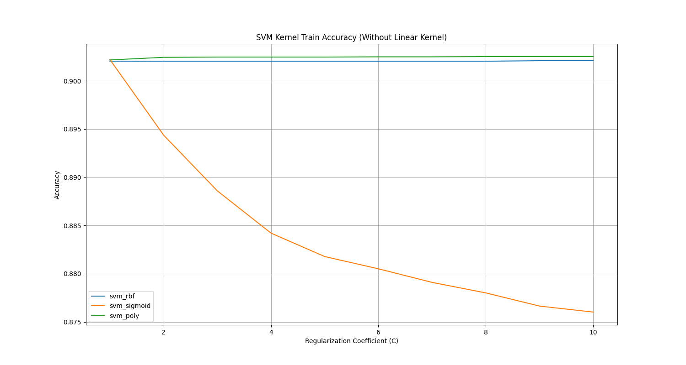

# Lab1: Report

> 21302010062 宋文彦

## 代码部分

#### 1. 数据集分割：

对cast中的数据，根据其属于测试/训练集进行划分，将正样本赋值为1，负样本为0，存放入 `target_list` 中。同时将对应的diagrams中的特征数据添加到 `data_list` 中。

#### 2. 模型：

调用 sklearn 的包完成了 LR 和 LinearSVM 的训练、测试和评估部分。

由于使用 linear kernel 时，SVM 收敛速度太慢，对 SVM 部分的代码进行了修改，增加了最大迭代次数 max_iter 和 patience 的参数：

- max_iter：可以通过参数 `--max_iter` 设置模型的最大迭代次数，防止因为收敛过慢而一直不停的迭代，程序无法停止。默认值为1000。
- patience：如果模型超过一定次数的迭代后准确率没有提高，就停止迭代。默认值为20。

（但最后发现py好像会自动提前停止，就没有用这部分代码）

## 结果

#### 1. 数据处理

由于实验时使用 `nohup ` 重定向输出（便于记录），编写了脚本进行处理，使用 pandas 进行绘图。脚本见：pj1/result_evaluate.py，实验图片见：pj1/*.png。

#### 2. 结果分析

1. 就运行时间而言，使用 Linear kernel 的 SVM 模型的所需时间最长（而且是在未完全收敛的情况下），LR 模型次之，Linear SVM 第三，使用其他核函数的 SVM 模型时间最短。

   

2. 就55个分类任务的训练和测试准确率而言，Linear SVM 的准确率波动最大，使用 Linear 核函数的 SVM 模型次之。剩余模型（LR、使用剩余三个核函数的 SVM 模型）波动率较小，55个分类任务的训练训练准确率均高于75%，测试准确率均高于80%；在第25-30，第37-45组分类任务重训练准确率较低。

   - Linear SVM 的准确率波动最大：本次任务的数据集在空间中不是很线性可分，模型在不同训练集子集上学到的决策边界可能有较大波动。
   - 对 Linear SVM 的进行了使用不同正则化系数的实验（结果见：pj1/lsvm_c_test_accuracy_plot.png 和 pj1/lsvm_c_train_accuracy_plot.png）

   

3. 对 SVM 模型来说，正则化系数相同（皆为1.0），线性（Linear）核函数的训练和测试正确率最差，其余效果类似。

   - 可能是线性核函数未能完全起到分离数据集的作用，

   

4. 对 SVM 核函数和正则化系数相关的讨论：

   1. 使用相同的核函数，正则化系数取值在 $[0, 100)$ 内波动时：

      - 使用 sigmoid 核函数时，其训练和测试的准确率呈对数型下降，下降速度最快的区间为 $[1, 10)$。
      - 使用其余类型的核函数时，准确率均呈线性且几乎不变。
      - 使用线性（Linear）核函数的 SVM 模型准确率最低。

      

   2. 将正则化系数缩减到 $[0, 10)$ 后：

      

   3. 去除了 `svm_linear`，便于查看其他三个核函数的效果（如上所述）

      

      

## 特征工程

#### 1. 降维：

考虑到本次数据集的特征维数较多（300维），优先考虑降维的方法。一开始使用划定的训练集和测试集，感觉结果区分度不强；

改用交叉验证法，实验中选择了5折（tsne由于交叉验证时间过长，仍使用默认划定的测试和训练集），发现 tsne 和 pca 的效果更好。

